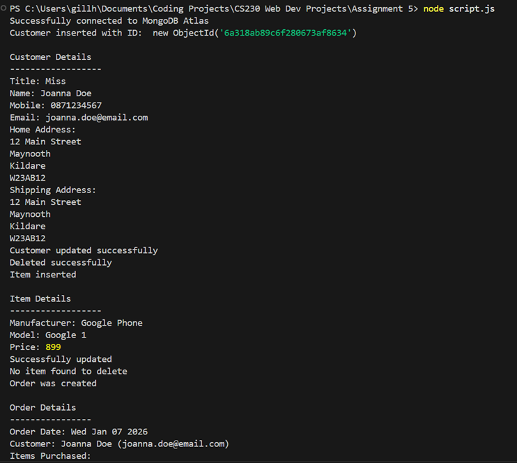

# Mobile Store MongoDB

A small Node.js project that uses MongoDB to store customers, phones, and orders.

This was a university assignment where I had to build CRUD functionality using a NoSQL database.

## Screenshot

## Features

- Add customers
- Find customers
- Update customers
- Delete customers
- Add phone items
- Create orders
- MongoDB Atlas connection

## What I Learned

This project was my first time working with MongoDB and NoSQL databases.

I learned that instead of storing data in tables like MySQL, MongoDB stores information in collections and documents. Lastly, I also learned how documents can contain nested objects, which made storing customer addresses much easier.

I also got introduced to MongoDB operators such as $set. Before this project I was used to updating data using SQL queries, but MongoDB uses operators to describe how documents should be modified. Using $set taught me how to update specific fields inside a document without replacing the entire document.
